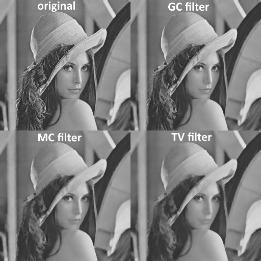

# Curvature filters are efficient solvers for variational models.
Curvature filter was developed by Yuanhao Gong during his PhD at MOSAIC Group. Please cite Yuanhao's PhD thesis if you use curvature filter in your work. Thank you!
***
@phdthesis{gong:phd, title={Spectrally regularized surfaces}, author={Gong, Yuanhao}, year={2015}, school={ETH Zurich, Nr. 22616},note={http://dx.doi.org/10.3929/ethz-a-010438292}}
***
Chapter **Six** in **<a href="http://e-collection.library.ethz.ch/eserv/eth:47737/eth-47737-02.pdf" target="_blank">PhD thesis</a>** (downloaded **700+** since June, 2015), Gaussian Curvature Filter (Talk Slides): **<a href="https://www.dropbox.com/s/ax73park0popi4x/GCFilter_small.pdf?dl=0" target="_blank">Dropbox</a>** or **<a href="http://pan.baidu.com/s/1gd4Km1H" target="_blank">Baidu</a>**, **source code** in **C++** and **Java** can also be found at **<a href="http://mosaic.mpi-cbg.de/?q=downloads/curvaturefilters", target="_blank">MOSAIC</a>**

The kernels summary and one example how to get the kernel can be found **[here](CF_Kernels.pdf)**

**<a href="https://groups.google.com/forum/?hl=en#!forum/curvaturefilter" target="_blank">Curvature Filter Online Forum</a>**, **<a href="http://www.zhihu.com/question/35499791" target="_blank">知乎上的介绍</a>**, **<a href="http://pan.baidu.com/s/1ntGfGQ9" target="_blank">简单的中文介绍</a>**
***
## Curvature filters minimize the regularization energy
Traditional solvers, such as gradient descent or Euler Lagrange Euqation, start at the total energy and use diffusion scheme to carry out the minimization. When the initial condition is the original image, the data fitting energy always increase while the regularization energy always reduces during the optimization. As illustrated in the below figure, regularization energy must be the dominant part since the total energy has to decrease. Therefore, **Curvature filters focus on minimize the regularization term,** whose minimizers are already known. For example, if the regularization is Gaussian curvature, the developable surfaces minimize this energy. Therefore, in curvature filter, developable surfaces are used to approximate the data. **As long as the decreased amount in the regularization part is larger than the increased amount in the data fitting energy, the total energy is reduced.**

## Running Time (10 iterations on 512X512 Lena image)
| Filter       | Bilateral Filter | Guided Filter | Guided Filter | MC Filter | MC Filter | GC Filter | GC Filter| Bernstein Filter |
| ------------- |:-------------:|:-------------:|:-------------:|:-------------:|:-------------:|:-------------:|:-------------:|:-------------:|
| Lang.      | C++ | Matlab | C++ | Matlab | C++ | Matlab | C++| C++|
| MilliSec.      | 103 | 514 | 130 | 21 | 12 | 20 | 11| 8|

Matlab version is R2015a and GCC version is 5.1. All tests are on a Thinkpad T410 with i7 core CPU.
***
## Features
#### 1) Computational Efficient  :
These filters are **three or four order of magnitude faster** than traditional solvers, such as mean curvature flow. 
#### 2) Generality  :
These filter solvers can handle **arbitrary imaging model**, as long as the imaging model can be evaluated(black box).
#### 3) Convergence :
The convergence is **theoretically guaranteed** and the numerical convergence rate is around 1.4 for natural images.
#### 4) Easy Implementation  :
These filters can be implemented in about 40 lines in Matlab and about 100 lines in C++. 

***
## Example Applications
### 1) Smoothing
GC = Gaussian Curvature, MC = Mean Curvature, TV = Total Variation

### 2) Denoising

The noise free test image can be downloaded **[here](images/developable.png)**
### 3) Cartoon Texture Decomposition

***
## FAQ:
1) Why dual mesh (DM) structure is needed?

There are two reasons. First, these four sets guarantee the convergence. Second, 
we can use the updated neighbors for current position. Therefore, it is more computational efficient.

====
2) What is the difference between these three filters?

In general, GC filter is better in preserving details, compared with the other two. And
TV filter is better in removing noise as well as details. MC filter is between these two.

These three filters are correspond to three types of variational models. User should decide
which prior is to be assumed about the ground truth. 

====
3) What is the difference between split and nosplit scheme?

In general, splitting the image into four sets and looping on them is computational faster.
However, in some cases like deconvolution, we need to merge the four sets after every iteration.
So, it is better do nosplit scheme.

These two lead to exactly the same result. The split code is just more cache friendly.
