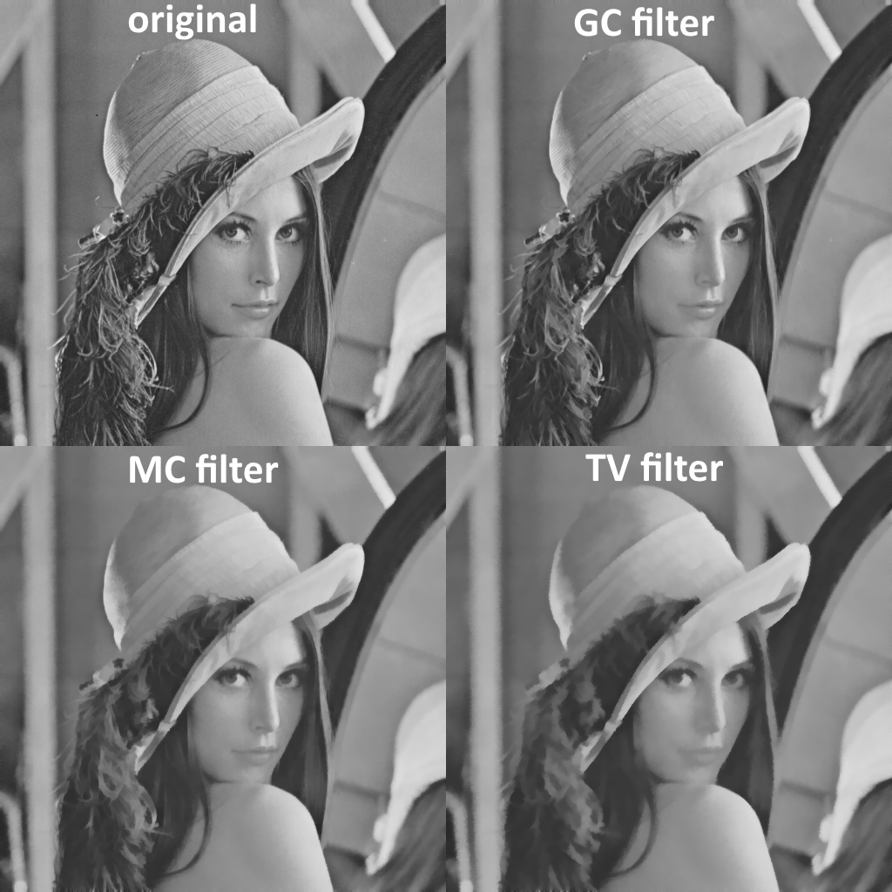
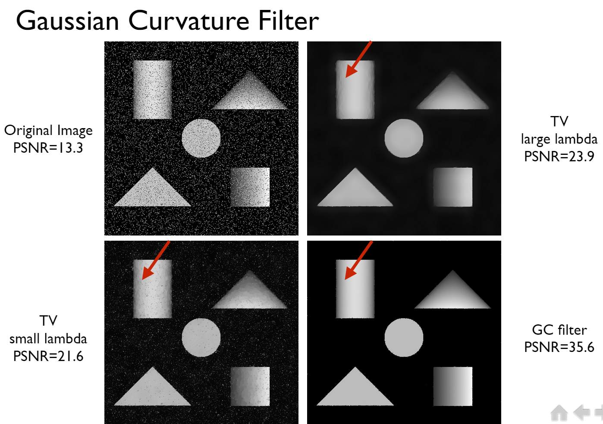

# Curvature filters are efficient solvers for variational models.
This code was developed by Yuanhao Gong during his PhD at MOSAIC Group. Please cite Yuanhao's PhD thesis if you use this code in your work. Thank you!
***
@phdthesis{gong:phd, title={Spectrally regularized surfaces}, author={Gong, Yuanhao}, year={2015}, school={ETH Zurich, Nr. 22616},note={http://dx.doi.org/10.3929/ethz-a-010438292}}
***
Chapter **Six** in **[PhD thesis](http://e-collection.library.ethz.ch/eserv/eth:47737/eth-47737-02.pdf)**, Gaussian Curvature Filter, **[Talk Slides](GCFilter.pdf)**

**source code** in **C++** and **Java** can also be found at **[MOSAIC](http://mosaic.mpi-cbg.de/?q=downloads/curvaturefilters)**
***
## Why regularization should be minimized?

#### 1) Computational Efficient
These filters are **three or four order of magnitude faster** than traditional solvers.
#### 2) Generality
These filter solvers can handle **arbitrary imaging model**, as long as the imaging model can be evaluated(black box). 
#### 3) Convergence
The convergence is **theoretically guaranteed** and the numerical convergence rate is around 1.4 for natural images.
#### 4) Easy Implementation
These filters can be implemented in about 40 lines in Matlab and about 100 lines in C++.

## One example
GC = Gaussian Curvature, MC = Mean Curvature, TV = Total Variation

## Another example

## FAQ:
1) Why dual mesh (DM) structure is needed?

There are two reasons. First, these four sets guarantee the convergence. Second, 
we can use the updated neighbors for current position. Therefore, it is more computational efficient.

====
2) What is the difference between these three filters?

In general, GC filter is better in preserving details, compared with the other two. And
TV filter is better in removing noise as well as details. MC filter is between these two.

These three filters are correspond to three types of variational models. User should decide
which prior is to be assumed about the ground truth. 

====
3) What is the difference between split and nosplit scheme?

In general, splitting the image into four sets and looping on them is computational faster.
However, in some cases like deconvolution, we need to merge the four sets after every iteration.
So, it is better do nosplit scheme.

These two lead to exactly the same result. The split code is just more cache friendly.
